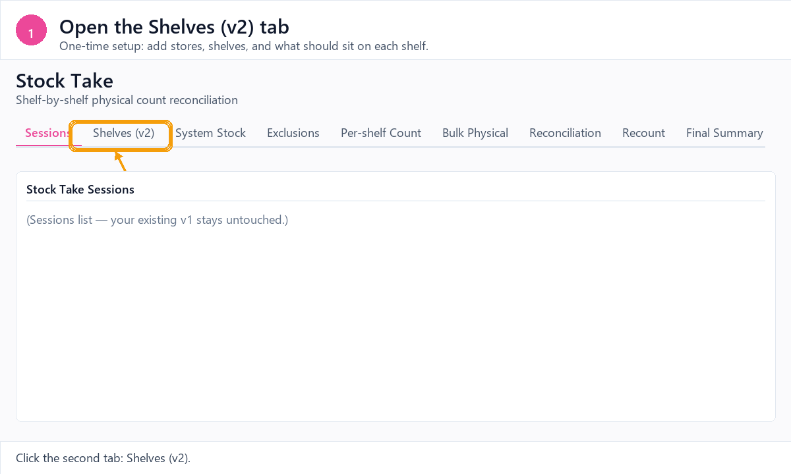
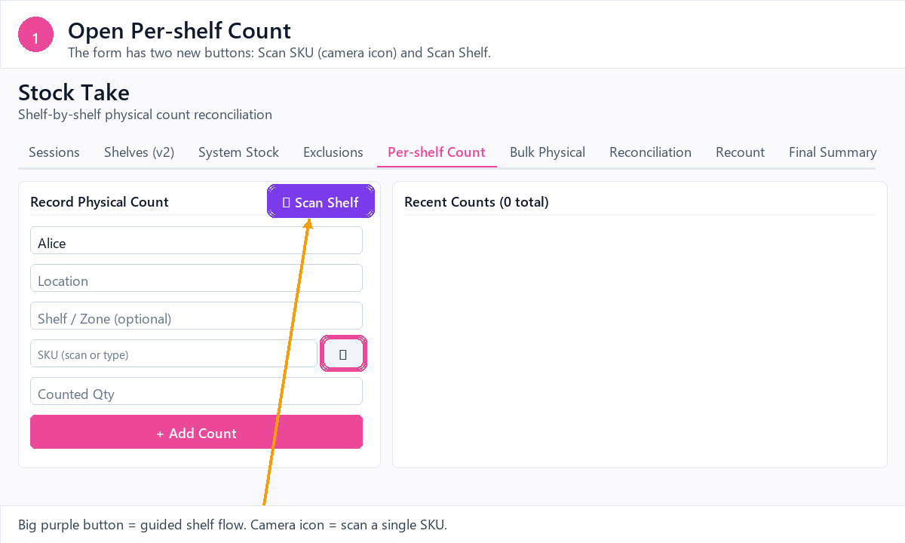
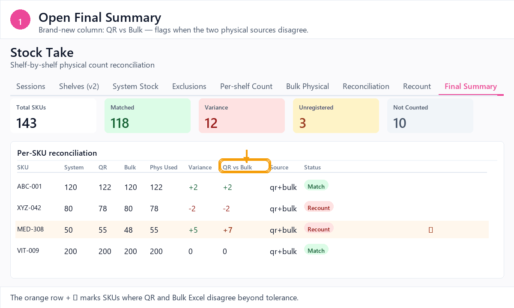
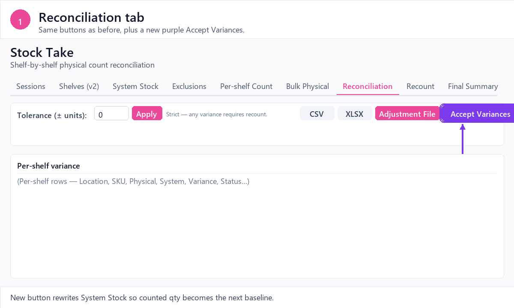
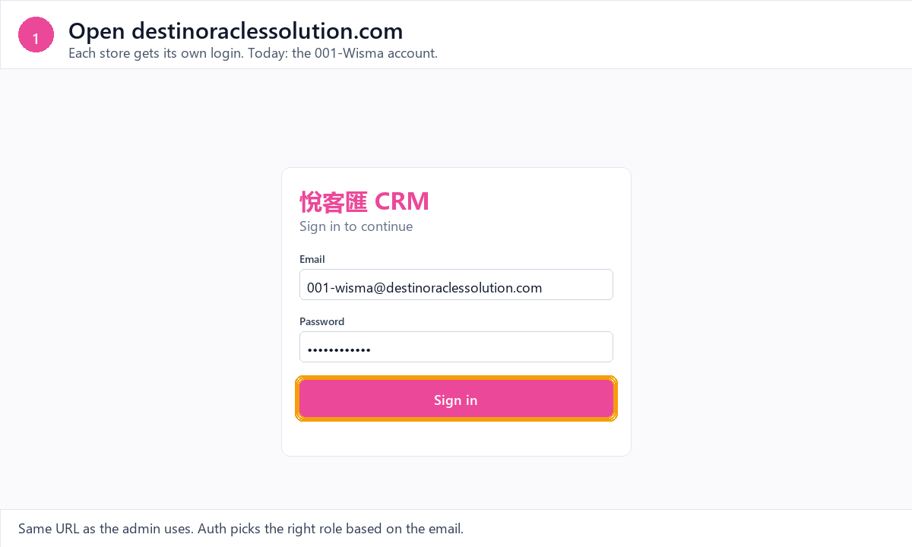
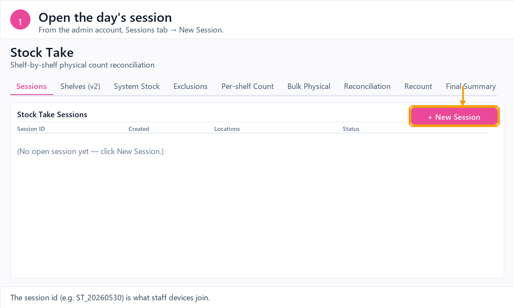

# Stock Take v2 — how to use the new features

The CRM's Stock Take module grew four new capabilities in commit `7eb3c8c`
(plus bug-fix commit `809b611`). Each GIF below walks through one workflow
end-to-end.

Open from the sidebar: **Stock Take** (Super Admin / Marketing Manager only).

---

## 1. One-time shelf master setup



In the **Shelves (v2)** tab, add each store and the shelves inside it. Stick
the QR-payload string on the physical shelf as a printed code label. Then
click **Expected** on a shelf row to map the SKUs that belong on it with
their target quantities. This data lives in Supabase and survives session
deletes / device wipes.

## 2. Scan a shelf and count



On the **Per-shelf Count** tab the SKU field grew a camera button, and the
header has a new purple **Scan Shelf** button. Tap Scan Shelf, point the
camera at a shelf's QR label, and the system opens a sheet listing every
product expected on that shelf with a one-tap quantity input. Unexpected
SKUs can be added inline. Saves write to both localStorage and Supabase so
a second tablet on the same session sees the counts in real time.

## 3. Three-way reconciliation



The **Final Summary** tab now shows independent **QR vs Bulk** variance. If
the QR scans and the Bulk Excel upload disagree by more than tolerance for
any SKU, the row is highlighted orange with a warning icon — even when the
combined Physical Used happens to match the System total. The reason input
appears on those rows so you can capture the cause (theft, mis-scan,
mis-import).

## 4. Accept variances as the next baseline



The **Reconciliation** tab has a new purple **Accept Variances** button.
Clicking it rewrites System Stock for the current session using the counted
physical quantities, so the *next* reconciliation starts from physical
reality. The Adjustment File export still lets you sync the same delta back
to your ERP.

## 5. Staff daily workflow (Level 15)



What a per-store counter account (`001-wisma`, `002-bayavenue`,
`003-bjpavillion`) sees from sign-in to saving counts. The sidebar contains
only Stock Take, and inside the module only Per-shelf Count / Recount /
Final Summary are visible — every setup tab is hidden. Tap **Scan Shelf**,
point at the QR label, type counts next to the expected SKU list, hit
**Save**. Counts sync live to the admin and any other staff tablet on the
same session. See `PROVISION_STAFF_ACCOUNTS.md` for how to create these
accounts.

## 6. Admin session lifecycle



The other side of the same workflow from the admin account: open a session
(Sessions tab → New Session), watch counts arrive live from store tablets
(blue "live" badge marks scans from other devices), open Reconciliation to
see variance and accuracy, hit Accept Variances when reality matches the
shelf, then close the session.

---

## Regenerating the GIFs

```
python docs/stock-take-v2/_make_gifs.py
```

The script renders each frame in PIL using the CRM's palette and writes
animated GIFs into this folder. Edit `gif_shelves`, `gif_scan_count`,
`gif_3way`, or `gif_accept_variances` in `_make_gifs.py` to tweak frame
content.

## Related commits

- `7eb3c8c` — feat(stock-take): Supabase shelf master, camera QR, 3-way reconciliation
- `809b611` — fix(stock-take): audit findings — 2 blockers + 3 follow-ups

## Related migration

- `migrations/stock_take_v2_2026-05-30.sql` — creates `st_stores`,
  `st_shelves`, `st_product_master`, `st_shelf_expected`, `st_sessions`,
  `st_counts`, `st_bulk_uploads`, `st_exclusions`, `st_variance_reasons`
  with RLS gated to `current_user_level() <= 2`.
