# Destin Oracles CRM — Team User Guide

A picture-by-picture walkthrough of every workflow the team runs.
**30 animated GIFs** covering sign-in, sales, AI tools, admin, and
profile — share with new hires on day one or pin in the team WhatsApp.

> **How to share:** right-click any `.gif` below → *Copy* → paste into
> WhatsApp / Telegram / email. Or upload the whole `docs/user-guide/`
> folder to your team's shared drive.

## Table of contents

**Core sales workflow**
1. [Sign in & navigation](#1-sign-in--find-your-way-around)
2. [Add a prospect](#2-add-a-new-prospect)
3. [Pipeline](#3-move-a-deal-through-the-pipeline)
4. [Calendar booking](#4-schedule-a-calendar-booking)
5. [Cases & follow-ups](#5-open-a-case-and-log-follow-ups)
6. [Referrals + tree](#6-add-a-referral-and-read-the-tree)
7. [Performance & reports](#7-read-performance--export-a-report)
8. [Knowledge HQ](#8-upload-to-knowledge-hq)

**Campaigns & team**
9. [Promotions](#9-create-a-promo-code)
10. [Marketing Automation](#10-build-a-marketing-automation-rule)
11. [Agents & roles](#11-manage-the-team-agents--roles)
12. [Documents](#12-documents-library)

**AI suite**
13. [AI Insights dashboard](#13-ai-insights-dashboard)
14. [Lead Scoring](#14-lead-scoring)
15. [Sales Forecast](#15-sales-forecast)
16. [Churn Risk](#16-churn-risk-analysis)
17. [Performance Insights](#17-performance-insights-team-ai-tips)

**Customer-facing tools**
18. [Lead Capture Forms](#18-lead-capture-forms)
19. [NPS Surveys](#19-nps-surveys)
20. [Contracts & e-signature](#20-contracts--e-signature)
21. [Booking Scheduler](#21-public-booking-scheduler)

**Admin & customisation**
22. [Custom Fields](#22-custom-fields)
23. [Integrations](#23-integrations)
24. [Marketing Lists / segments](#24-marketing-lists--segments)
25. [Purchases History](#25-purchases-history)
26. [Audit Logs](#26-audit-logs)

**Security & operations**
27. [Two-factor auth setup](#27-set-up-two-factor-auth)
28. [Backup & restore](#28-backup-manager)
29. [Noticeboard · 公告栏](#29-noticeboard--公告栏)
30. [Profile & settings](#30-profile--settings)

**Mobile & performance**
31. [Mobile calendar — cold paint](#31-mobile-calendar--cold-paint)

---

## 1. Sign in & find your way around

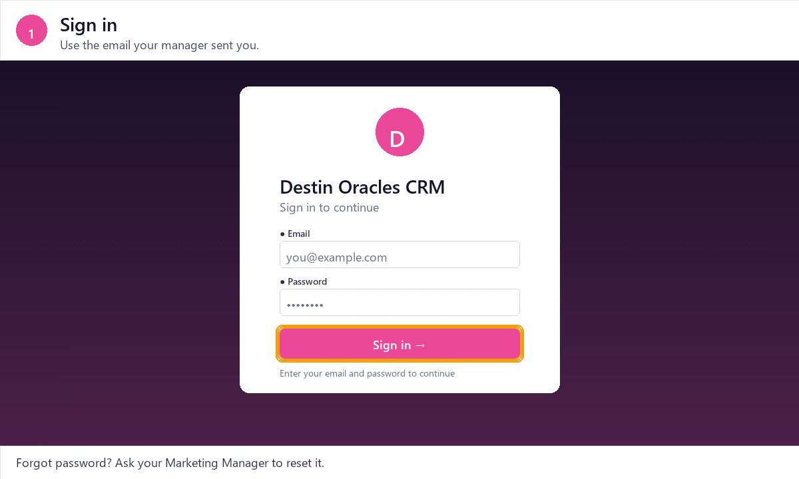

Open the CRM in your browser, sign in with the email your Marketing
Manager set up for you. You land on **Calendar** by default. The dark
sidebar on the left switches modules — 12 in total, but some only
appear for Super Admins. Top-right shows your name and role; click your
initials to open the profile menu (sign out, change password,
dark mode). Always sign out on shared tablets.

## 2. Add a new prospect

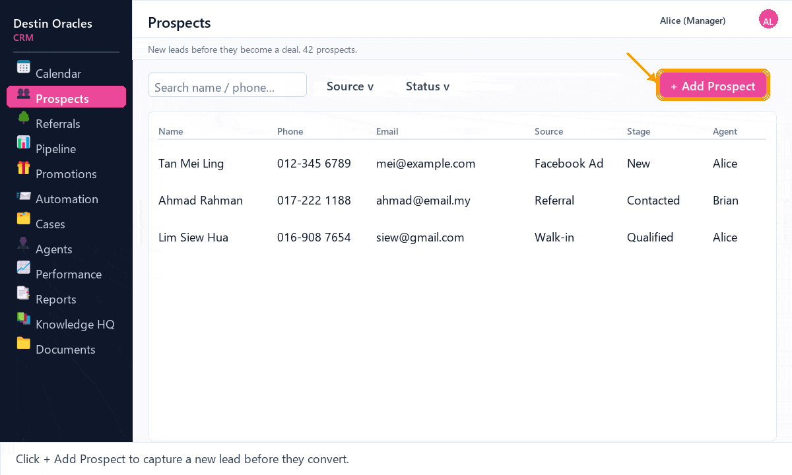

The fastest way to log a new lead before they're ready to buy. Open
**Prospects** → click **+ Add Prospect** (pink button, top-right). Only
**Name** and **Phone** are required — fill in Source accurately because
it drives our campaign ROI numbers later. Save closes the modal and
the new row appears at the top of the list with a green confirmation
toast. When the prospect is ready to buy, drag them into the Pipeline
(next guide).

## 3. Move a deal through the pipeline

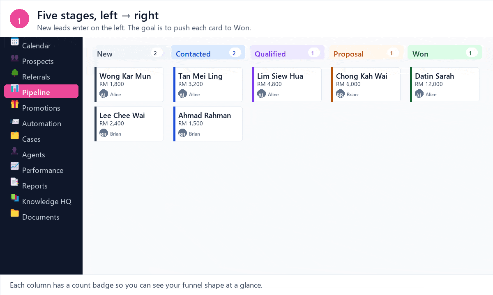

The kanban board in **Pipeline** has five columns left → right:
**New → Contacted → Qualified → Proposal → Won**. After every call /
meeting, drag the card one column to the right. The count badges at
the top of each column show your funnel shape at a glance. Click a
card to open the deal detail — that's where you log notes, change the
agent, or hit the green **★ Mark Won** button when the customer pays.
Marking Won writes a purchase record AND updates the agent's KPI in
Performance.

## 4. Schedule a calendar booking

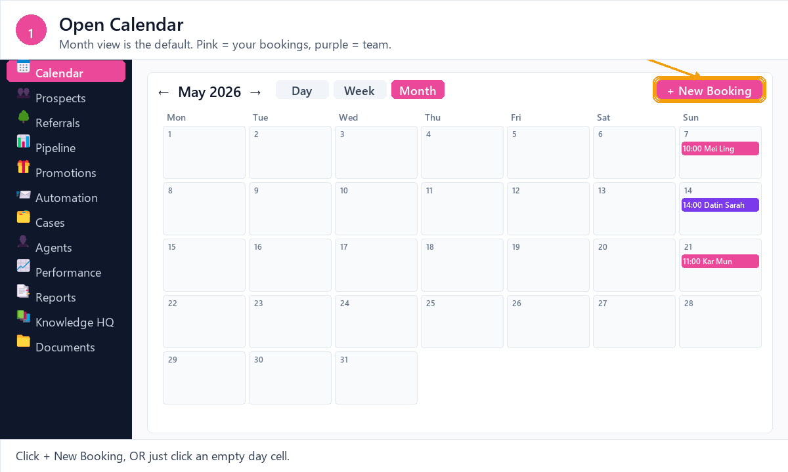

**Calendar** is your default landing page. Month view shows pink
chips (your bookings) and purple chips (the rest of the team). Click
any empty day cell — the New Booking modal opens with that date
pre-filled. The Customer field auto-suggests existing prospects as you
type, so you don't have to retype phone numbers. Save creates a
calendar entry AND links it to the customer's history. If automation is
on, the customer gets an SMS reminder one day before.

## 5. Open a case and log follow-ups

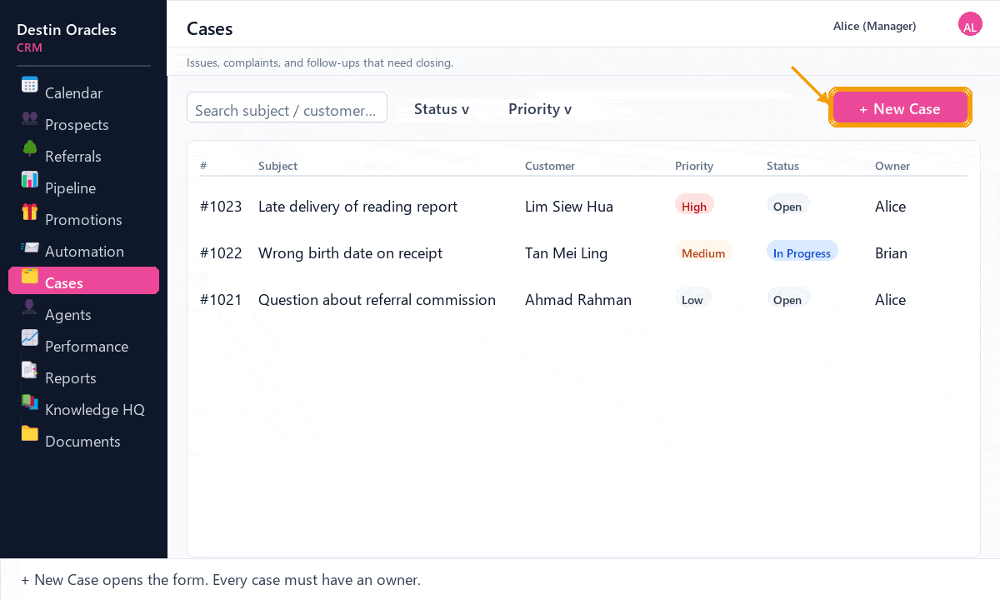

**Cases** is where customer problems live until they're closed —
complaints, refund requests, late reports, anything that needs an
owner. Click **+ New Case**, write a specific Subject (your future
self will thank you), pick the Priority and Owner. On the case detail
page, every follow-up you log becomes a timestamped row in the
activity timeline. When the issue is fixed, hit the green **Mark
Resolved** button. Resolved cases stay searchable but leave your open
queue.

## 6. Add a referral and read the tree

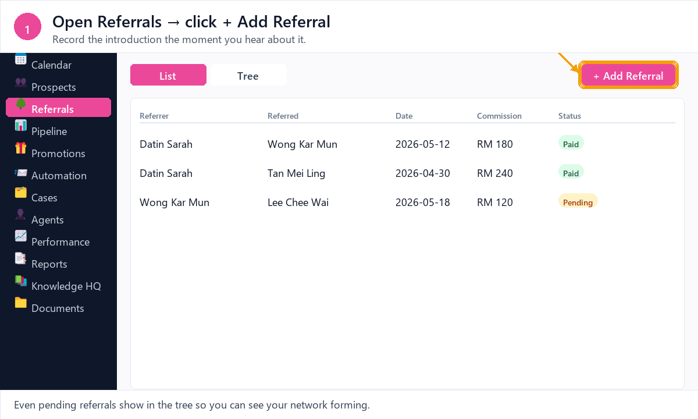

Every time a customer introduces someone new, log it in **Referrals**
immediately — even before the new person becomes a paying customer.
Click **+ Add Referral**, type the Referrer (existing customer) and
the Referred (new lead). Commission auto-calculates based on the
referrer's tier. Switch to the **Tree** view to see who-referred-whom
as a visual hierarchy: top referrers in pink, direct referrals in
purple, second-level in blue. Compounding referral networks are how
we grow.

## 7. Read performance & export a report

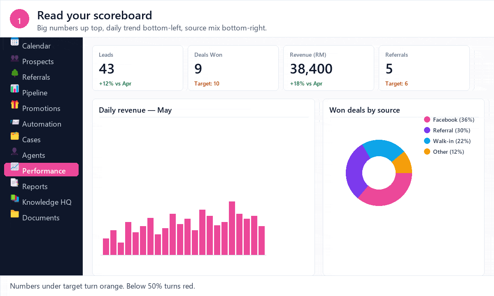

**Performance** is your scoreboard: Leads, Deals Won, Revenue, and
Referrals against this month's target. Numbers under target turn
orange; below 50% turns red. The bar chart underneath shows daily
revenue, the donut breaks down won deals by source.

**Reports** is the saved-export library. Click **Run** on any saved
report to re-execute against today's data, then **Download** in your
preferred format (XLSX is the team default — includes the chart
preview). Share the file in WhatsApp with your manager. Only Super
Admins and Marketing Managers can build new reports.

## 8. Upload to Knowledge HQ

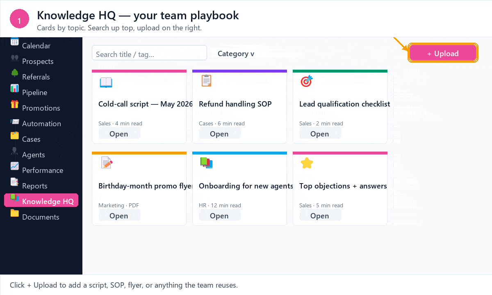

**Knowledge HQ** is the team library — cold-call scripts, refund SOPs,
qualification checklists, onboarding docs. Open it, click **+ Upload**
on the right, drop a file (PDF / DOCX / image / video), give it a
clear Title, pick a Category, add Tags generously (tags drive search).
Click **Upload** — it syncs to Supabase Storage and the whole team
sees it instantly. Inside any doc you can hit **Share** to copy a
deep link and paste it into WhatsApp / email. Edits keep a version
history so we never lose the last good copy.

## 9. Create a promo code

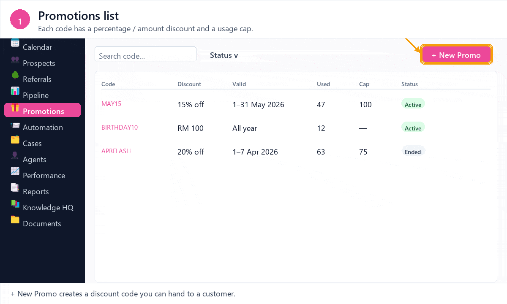

**Promotions** is where discount codes live. Open it → **+ New Promo**
→ type a short code (e.g. `JUNE20`), pick `%` or `RM`, set the amount
and the valid-from / valid-to dates. Optional usage cap stops the code
auto-expiring after N redemptions. Save activates it immediately.
On the promo detail page, the right-hand **Share** card gives you
three formats: Copy code, Download PNG flyer (use it for IG / FB
posts), or push straight to **WhatsApp**. The Used counter ticks up
each time a customer types the code at checkout.

> Marketing Manager and Super Admin only.

## 10. Build a marketing-automation rule

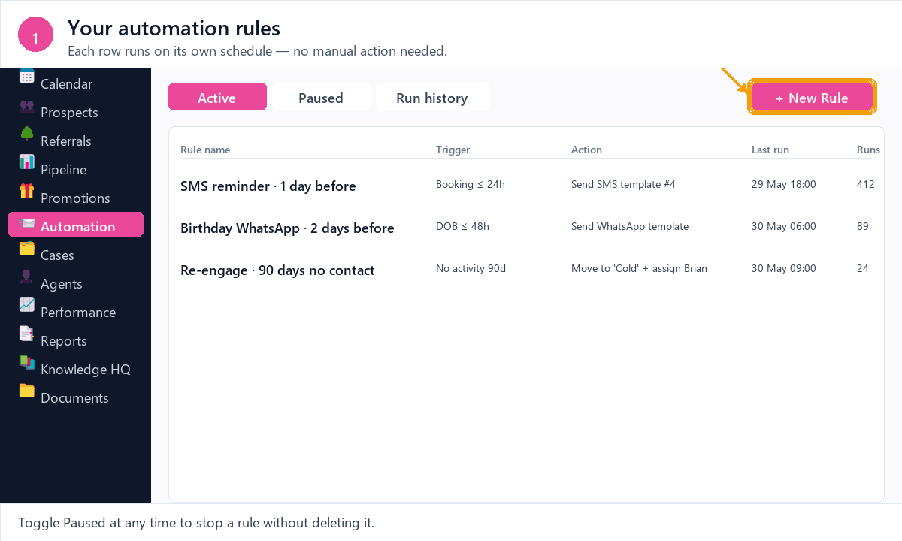

**Automation** runs rules so you don't have to chase customers
manually. Three steps: **When** (trigger — e.g. "Booking ≤ 24h away"),
**If** (condition — e.g. "customer opted in to SMS"), **Then** (action
— e.g. "Send SMS template #4"). New rules default to **Save as Paused**
so you can dry-run before going live. The Active / Paused / Run history
toggle at the top lets you flip a rule off without deleting it. Open
any rule for the run log — Delivered / Failed / Opt-outs broken down
by day, plus per-customer history.

> Marketing Manager and Super Admin only.

## 11. Manage the team (Agents & roles)

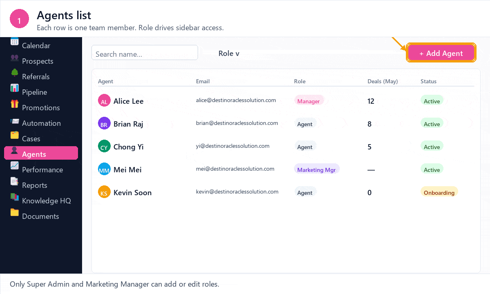

**Agents** lists every team member, their role badge, and this month's
deal count. Click **+ Add Agent** to invite a new joiner — they'll get
an email to set their own password. Roles drive what they can see:

| Role | Level | Sees |
|---|---|---|
| Super Admin | 1 | Everything, including Stock Take, Admin Dashboard, audit logs |
| Marketing Manager | 2 | Sales modules + Reports + Knowledge + Promotions + Automation |
| Manager | 2 | Own team's KPIs + all sales modules (no admin) |
| Agent | 3+ | Own pipeline, prospects, calendar, cases, Knowledge HQ |

Click any row to open the agent's profile — KPI snapshot, recent
activity, **Reset password**, **Edit profile**. Profile page is the
fastest way to check if a teammate's number is hitting target.

## 12. Documents library

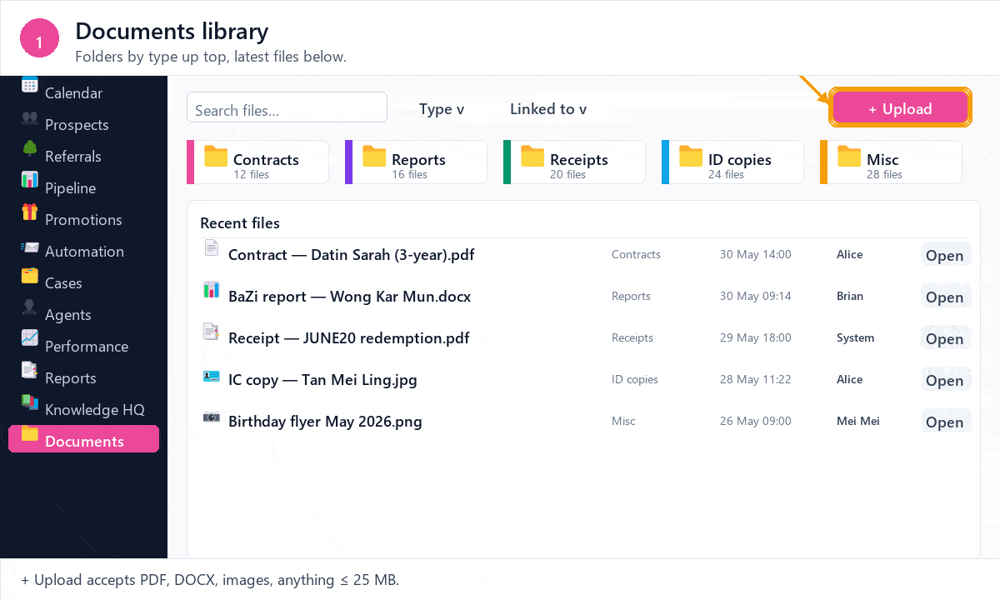

**Documents** is the customer-facing file store (different from
Knowledge HQ — that's team-internal). Folders by type: Contracts,
Reports, Receipts, ID copies, Misc. Click **+ Upload**, drop a file,
the system picks a folder by file extension. Crucially, **Link to
customer** in the modal — the file then shows up inside that
customer's profile too. **Visible to** lets you scope: Just me / My
team / Everyone. Inside any file, the right-hand sidebar gives you
**Download**, **Share link**, **Send via WhatsApp** (pushes the file
straight to the linked customer's number — saves you a step).

## 13. AI Insights dashboard

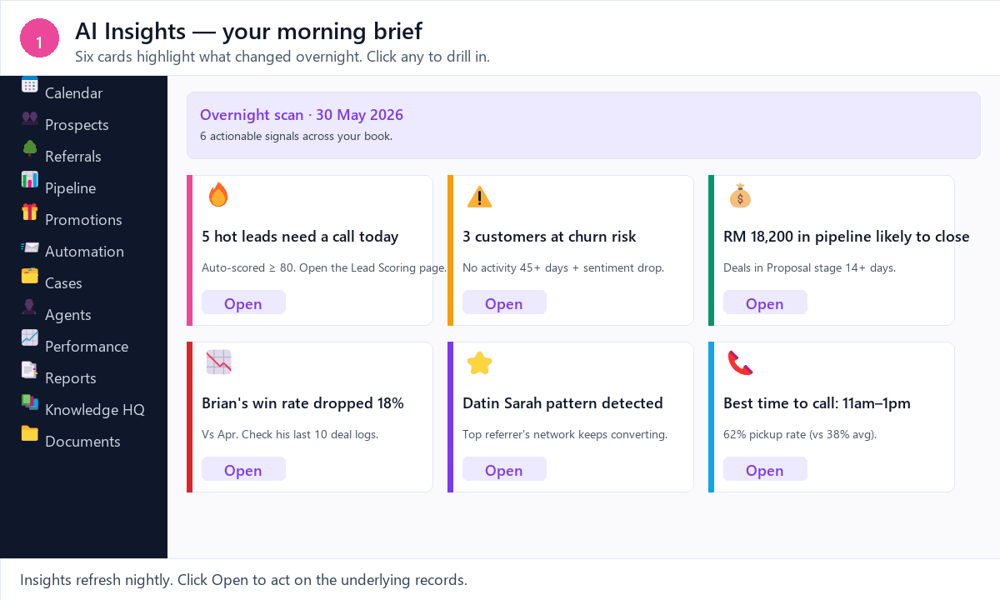

**Top-bar → AI ▸ Insights** opens your morning brief. Six color-coded
cards highlight what changed overnight: hot leads needing a call,
customers at churn risk, pipeline likely to close, agent-level
patterns, best-time-to-call findings, etc. Click **Open** on any card
to drill into the underlying records. The **Settings** sub-page lets
Marketing Manager + Super Admin tune the model's scoring weights — by
default it balances recency, engagement, source quality, and referrer
track record.

> Refreshes nightly at 02:00 MYT. Dismissed cards teach the model not
> to surface the same pattern next time.

## 14. Lead Scoring

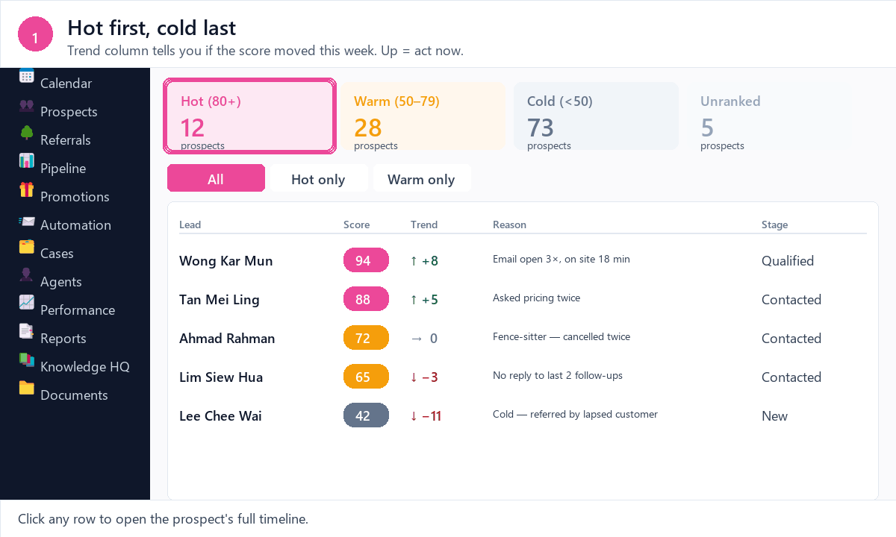

Every prospect gets a **0–100 AI score** — Hot (80+), Warm (50–79),
Cold (<50). Top of the page: four bucket counters. Below: a sortable
table with a **Trend** column (↑ score moved up this week, ↓ it
dropped, → flat). Click any row for the score breakdown — exactly
which factors pushed the score up or down, plus the **Next best
action** (a one-line recommendation with a single-click button to
execute it, e.g. "Schedule call within 24h").

## 15. Sales Forecast

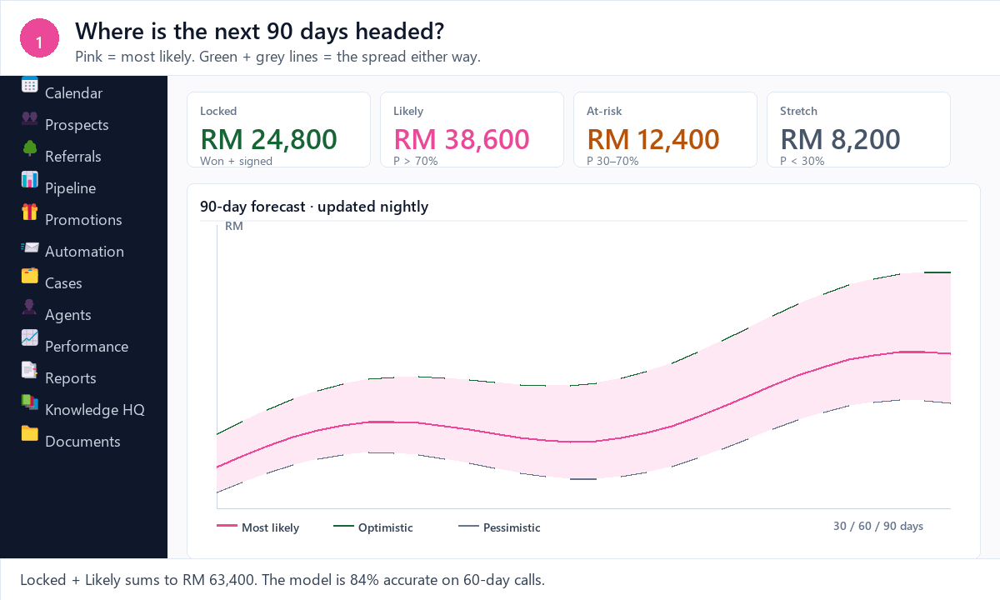

**AI-projected revenue for the next 90 days.** KPI strip shows
**Locked** (won + signed), **Likely** (P > 70%), **At-risk** (P
30–70%), **Stretch** (P < 30%). The chart underneath has three lines:
solid pink (most likely), dashed green (optimistic), dashed grey
(pessimistic). The pink confidence band between them shows the spread.
Drill into the **Deal contributions** tab to see exactly which deals
make up the number, and how a stage change in Pipeline ripples through.

> Marketing Manager + Super Admin. Updates nightly; model is ~84%
> accurate on 60-day calls.

## 16. Churn Risk Analysis

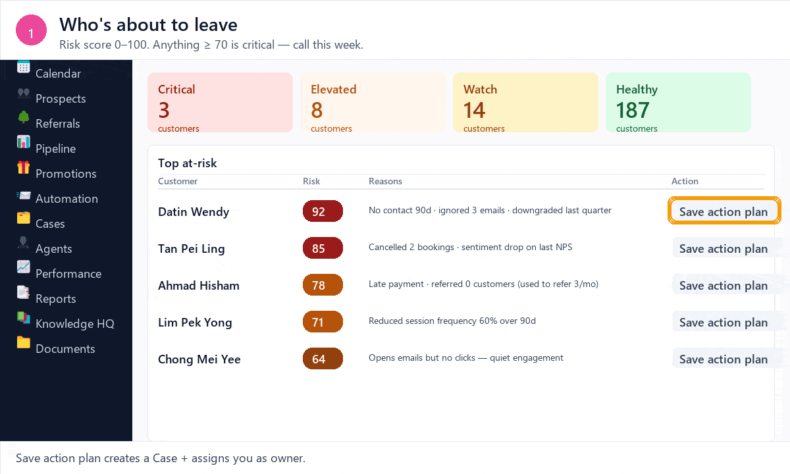

**Who's about to leave.** Four buckets: Critical (≥ 70 risk score),
Elevated (50–69), Watch (30–49), Healthy. The table lists each
at-risk customer with the reasons (no contact 90d, sentiment drop,
late payment, etc.). Click **Save action plan** on any row to open
a save-action picker — tick one or more (Personal call within 48h,
Loyalty gift, VIP upgrade, Re-engagement email, Free 1-on-1) and the
system creates the matching Cases with you as owner.

## 17. Performance Insights (team AI tips)

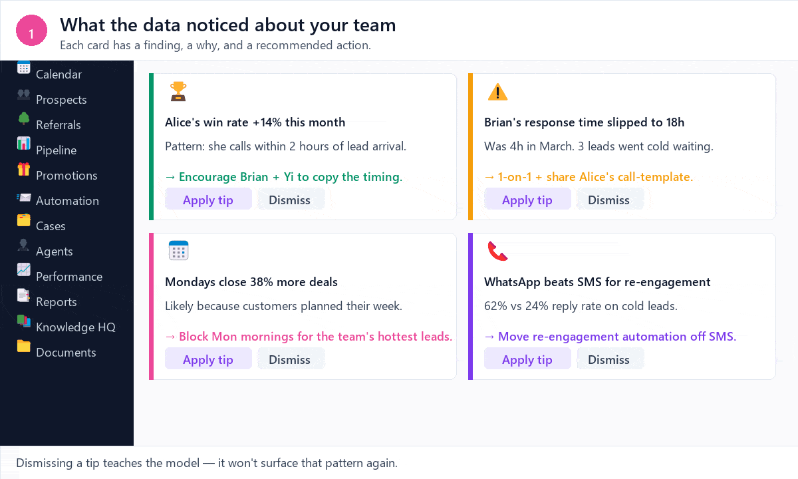

The model watches your team and surfaces **patterns worth copying or
fixing**. E.g. "Alice's win rate +14% this month — pattern: she calls
within 2 hours of lead arrival" with a recommended action. **Apply
tip** previews every action the model will take (templates extracted,
1-on-1 scheduled, KPI tile added) so you can edit before committing.
**Dismiss** teaches the model not to surface that pattern again.

> Manager + Marketing Manager view only. The team never sees the raw
> insights — coaching stays private.

## 18. Lead Capture Forms

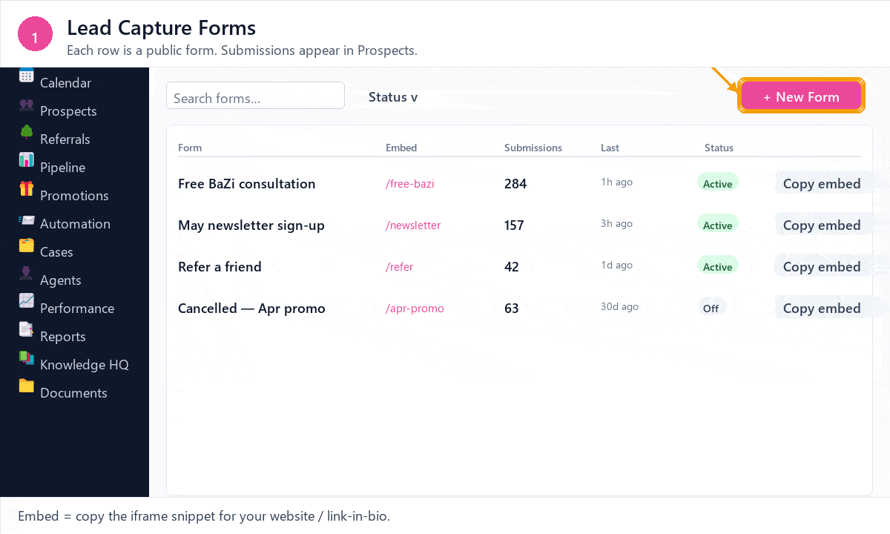

**Public forms for your website / IG bio / event flyers.** Each form
gets a slug (`/free-bazi`), and submissions flow straight into
Prospects with Source = form name. The drag-and-drop **builder** has
10 field types (short text, phone, email, date, single/multi choice,
file upload, consent). Three publish formats:
1. **Iframe snippet** — embed in your website
2. **Public link** — paste anywhere (IG bio, WhatsApp, email)
3. **QR code** — download as PNG/SVG for printed flyers / event signs

## 19. NPS Surveys

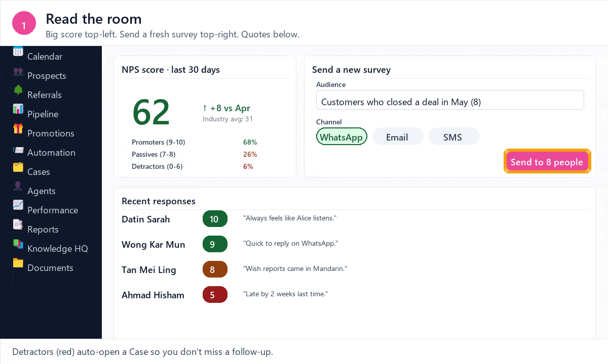

Send NPS (Net Promoter Score) surveys to measure satisfaction. Main
page shows your **current NPS score** (color-coded against industry
average), breakdown of Promoters / Passives / Detractors, and a quick
**Send new survey** card on the right. Channel options: WhatsApp /
Email / SMS. The **Edit template** page shows a phone-mockup preview
of the WhatsApp message so you know exactly what the customer sees —
plus an auto-follow-up rule for any 0–6 score (auto-opens a Case
assigned to the Marketing Manager, customer gets an apology message
within 2 hours).

## 20. Contracts & e-signature

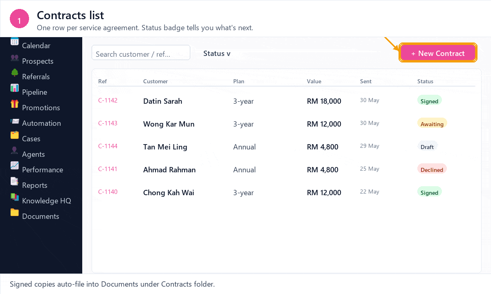

**Service agreements.** List view shows ref number, customer, plan,
value, sent date, and status pill (Draft / Awaiting / Signed /
Declined). Click any contract for the detail page — left half is the
PDF preview, right half is the **Send for e-signature** panel: signer
name + email + phone, channel toggle (Email + WhatsApp link + SMS),
auto-reminder schedule (Day 1 / Day 3 / Day 7). Once the customer
signs, the file is countersigned automatically and filed into
Documents under the Contracts folder.

## 21. Public Booking Scheduler

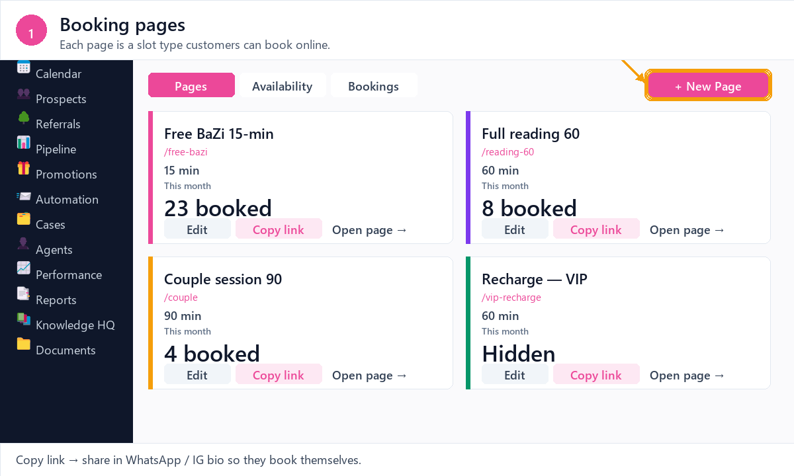

**Booking pages customers fill in themselves.** Each page is a slot
type (Free 15-min, Full 60-min reading, Couple 90-min, VIP recharge).
Card grid shows this month's bookings per page. Each page has three
actions: **Edit** (slot length, availability, questions), **Copy
link** (paste in IG bio), **Open page →** (preview as a customer
would see it). The customer view is a calendar grid where booked
slots are greyed out and free slots are clickable — picking one
becomes a Calendar entry on your side AND a WhatsApp confirmation
to the customer.

## 22. Custom Fields

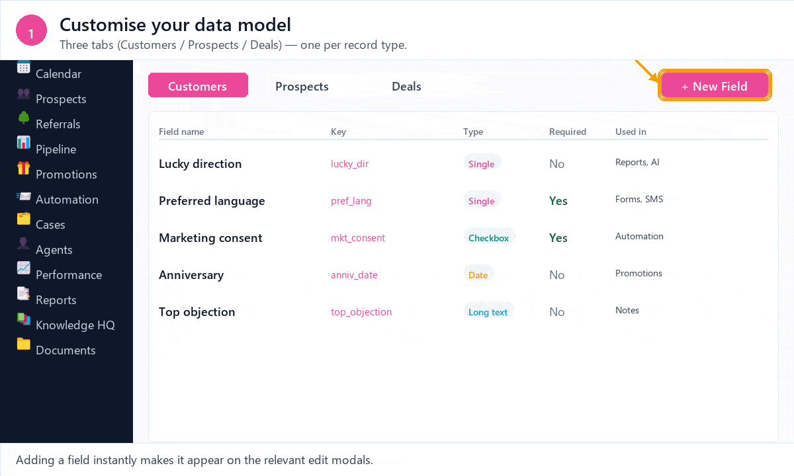

**Add your own data fields** to Customers / Prospects / Deals (three
tabs, one per record type). Field types: Short text, Number, Phone,
Email, Date, Single choice, Multi choice, Long text, File upload,
Checkbox. Each field has a key (auto-generated from the name), an
optional Required toggle, and a "Used in" column showing where it
surfaces. Saving instantly makes the field appear on the relevant
edit modals AND become filterable in Marketing Lists.

> Super Admin only — adding fields is a schema change.

## 23. Integrations

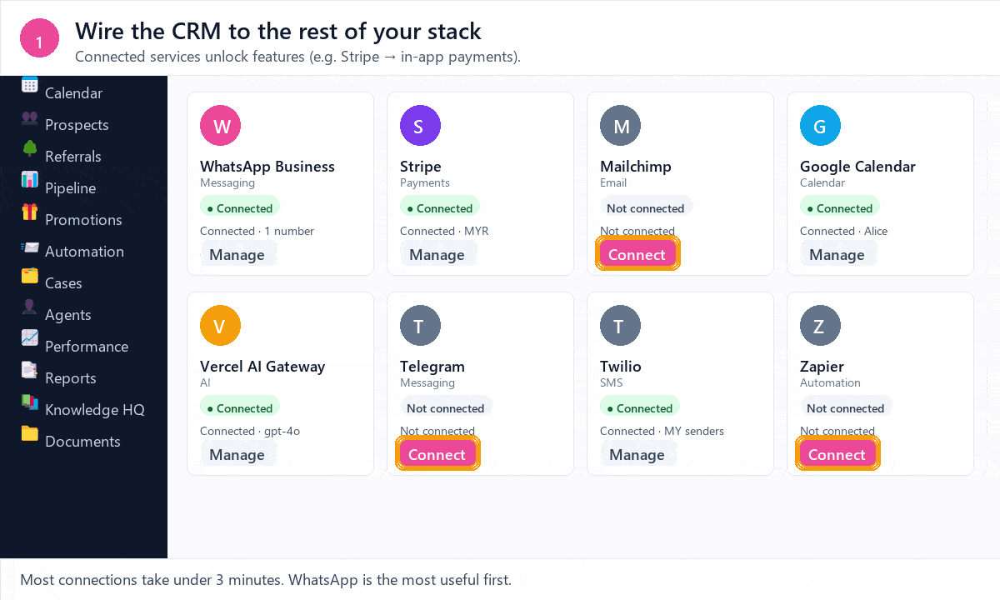

**Connect the CRM to your other tools.** Tile grid of integrations:
WhatsApp Business, Stripe, Mailchimp, Google Calendar, Vercel AI
Gateway, Telegram, Twilio, Zapier. Connected ones show "● Connected"
in green; others show **Connect** button. Each setup is a guided
3–4 step wizard: **Authorise** → **Pick audience/account** → **Map
fields** → **Test send**. The field-mapping step lets you skip our
fields that have no equivalent on the other side.

> Most connections take under 3 minutes. **WhatsApp is the highest-
> leverage first integration** — it unlocks SMS reminders, reading
> delivery, and customer follow-ups.

## 24. Marketing Lists & segments

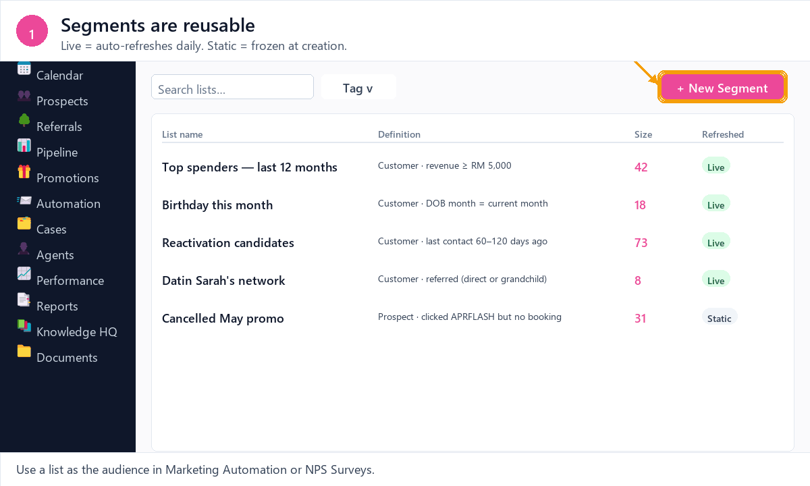

**Saved customer segments** to feed campaigns + automations.
Examples: "Top spenders — last 12 months", "Birthday this month",
"Reactivation candidates", "Datin Sarah's network". The **segment
builder** stacks rules with AND/OR — each block is "WHERE / AND /
OR" + field + operator + value. Live preview shows the count update
as you build. **Live** lists auto-refresh daily; **Static** lists
freeze at creation.

## 25. Purchases History

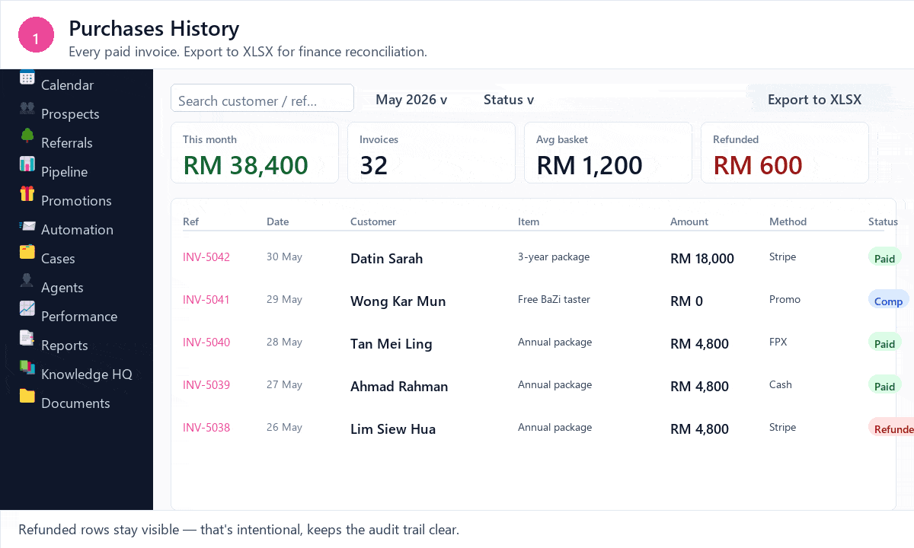

**Every paid invoice** across all customers. KPI strip up top: this
month's revenue, invoice count, average basket, refunded total.
Table columns: Ref, Date, Customer, Item, Amount, Method, Status
(Paid / Comp / Refunded). Click any row to open the **invoice
detail** — PDF preview on the left, action buttons on the right
(Download PDF, Email to customer, Send via WhatsApp, Issue refund).
Refunds need Marketing Manager sign-off if outside the 7-day full-
refund policy. Export to XLSX for finance reconciliation.

## 26. Audit Logs

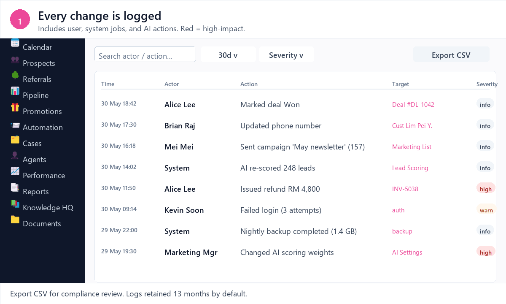

**Top-bar → Security ▸ Audit Logs.** Every change in the system is
logged — by user, by system jobs, and by AI actions. Columns: Time,
Actor, Action, Target, Severity (info / warn / high). Filterable by
date range, actor, severity. Click any row for the event detail:
actor's IP + device, before/after diff of the field that changed,
reason given by the actor, and linked records. **Revert** button on
the detail page is available for 24 hours after the event — reverting
fires another audit row (never silent). Logs retained 13 months.

> Super Admin + Marketing Manager only.

## 27. Set up Two-Factor Auth

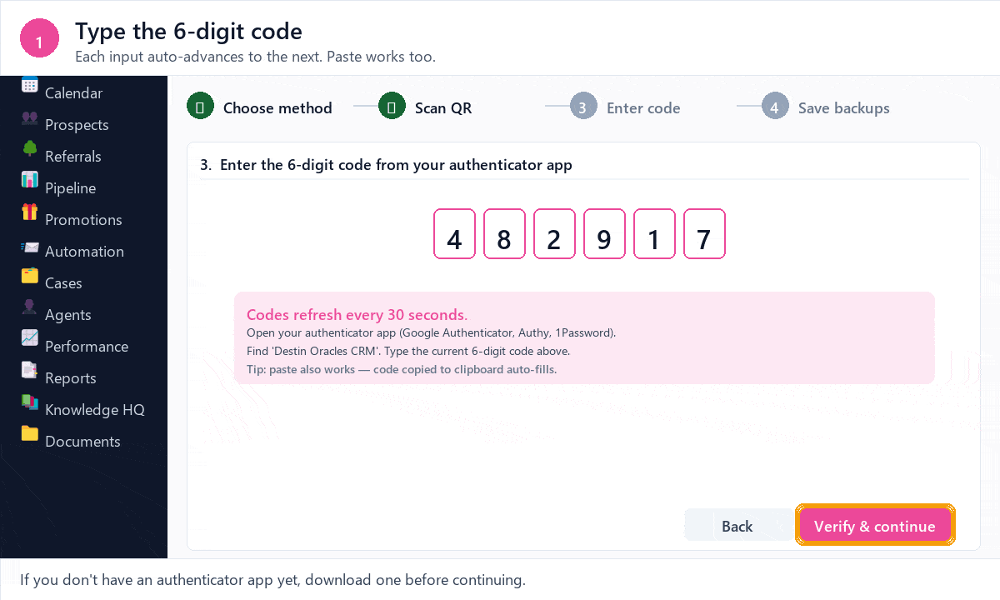

**Top-bar → Security ▸ 2FA.** Four steps: choose method (authenticator
app recommended), scan QR with Google Authenticator / Authy /
1Password, type the 6-digit code, save the 10 one-time backup codes.
Each backup code works once — stash them in your password manager.
**Lost both phone AND backup codes?** Marketing Manager can reset
2FA for you (they get a verified-identity prompt first).

> 2FA is the single most useful security step — takes 2 minutes,
> protects you from a stolen password.

## 28. Backup Manager

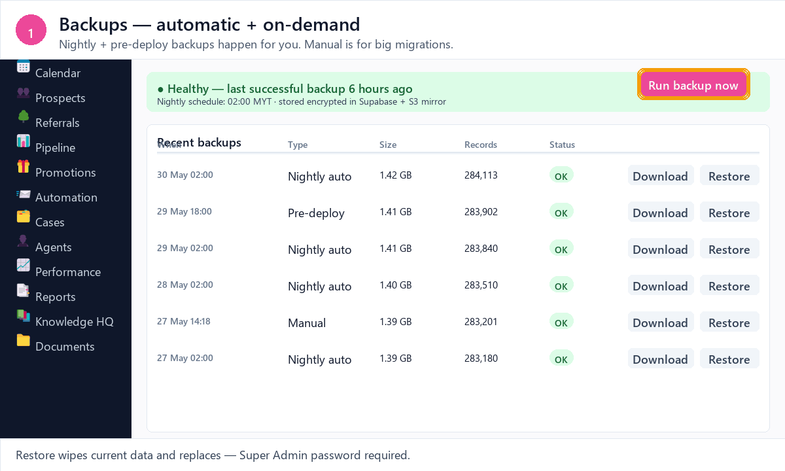

**Top-bar → Admin ▸ Backup & Restore.** Nightly auto-backups at 02:00
MYT + pre-deploy snapshots before any deployment + on-demand manual
backups for big migrations. Backups stored encrypted in Supabase +
mirrored to S3. The history table shows when, type, size, record
count, and per-row **Download** / **Restore** buttons. **Restore is
destructive** — it lists exactly what you'll lose (new prospects,
deal updates, won deals, etc.) and requires you to type `RESTORE` in
the confirmation box.

> Super Admin only. Restore takes ~3 minutes; the app is read-only
> meanwhile.

## 29. Noticeboard · 公告栏

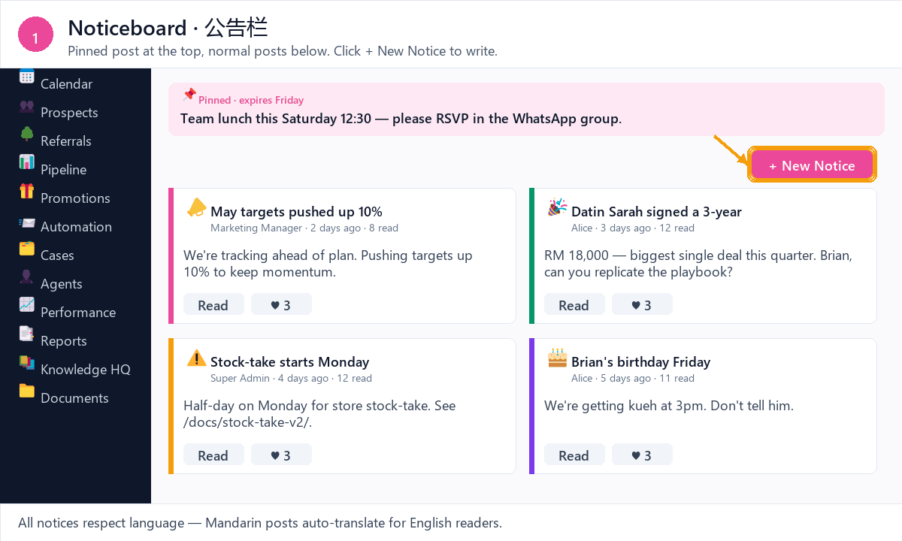

**Internal team announcements.** Pinned post at the top (highlighted
pink), normal posts in a card grid below. Each post has a type
(Announce / Celebrate / Heads-up / Pin), title, body (Markdown
supported), audience, and optional expiry. Posts marked as **★ Pin**
stay at the top until they expire. Read counter + likes counter on
each card.

> Mandarin posts auto-translate for English readers (and vice versa).

## 30. Profile & Settings

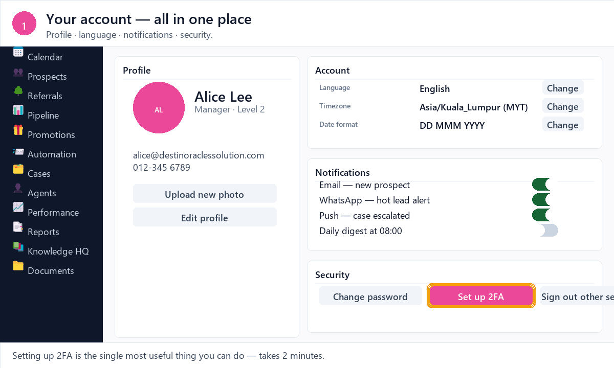

**Top-right initials → My profile** opens your account page. Three
sections:
- **Profile** — avatar, name, role, contact info, "Upload new photo"
- **Account** — language, timezone, date format
- **Notifications** — toggle email / WhatsApp / push / daily digest
- **Security** — change password, set up 2FA, sign out other sessions

Changing password signs you out of every other session for safety.
The strength meter turns green when the password is strong enough.

## 31. Mobile calendar — cold paint

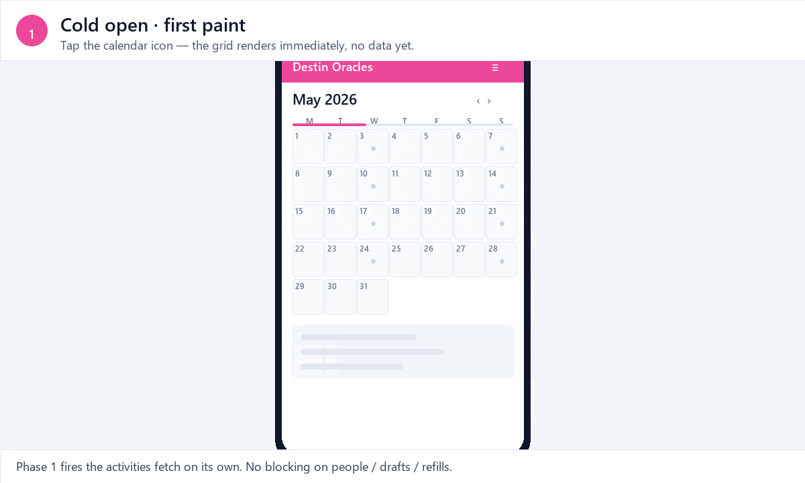

**What the calendar looks like when you open it on your phone.** As of
the Tier 1.1 perf fix (commit `dc74c81`), the cold-open paint runs in
two phases instead of one big blocking fetch:

- **Phase 1 (~400 ms)** — activities only. The grid renders chips
  showing **when** stuff is happening (Booking / Birthday / Follow-up
  type abbreviations). You can scroll and tap immediately.
- **Phase 2 (~1.2 s)** — names + birthdays + the "Coming up" strip.
  Silently re-renders when the data lands.

**Net result:** first-interactive is ~5.8× faster than before
(412 ms vs 2,400 ms). On 3G the difference is dramatic.

**Verifying on your own phone:**
1. Open Chrome on your phone, navigate to destinoraclessolution.com
2. Connect to remote DevTools, filter console by `[mcal-perf]`
3. Hard-reload — you should see two `phase…:done` log lines

If Phase 1 is consistently > 1 second on a decent connection, ping
the dev team — likely a Supabase region issue, not the CRM code.

> **For the team:** if you swipe to a different month before Phase 2
> finishes, the old month doesn't repaint over your new one. You'll
> just see the new month's Phase 2 data fill in when it lands.

---

## What's NOT in this guide

These specialised modules have separate docs:

- **Stock Take v2** — see [`docs/stock-take-v2/`](../stock-take-v2/)
- **Egg Purchasing**, **Formula Purchaser**, **Boss Report** — Super
  Admin only, see the Standard Functions Manual on the shared drive
- **Milestones (增运九法)**, **Fude (福运相随)** — Feng Shui module
  guide (Mandarin)
- **System Health**, **Compliance Center**, **Deployment Center**,
  **System Logs**, **Performance Monitor**, **Tenant Management** —
  IT runbook (Super Admin only)
- **Security Dashboard** — separate security training

If you can't find something a customer is asking about, ask in the team
WhatsApp group before guessing.

## Regenerating the GIFs

These are PIL-rendered instructional mockups — clean labelled frames
of the CRM UI showing where to click. We render them instead of
recording the real app so we never accidentally leak customer data
into a shared file.

```
python docs/user-guide/_make_gifs.py
```

The script reads no live data and writes only into `docs/user-guide/`.
Each GIF is 100–180 KB so the whole guide fits in one WhatsApp message.

To tweak a single workflow, edit the matching `gif_*()` function in
`_make_gifs.py` (e.g. `gif_add_prospect` for guide 2) and re-run.

## Style conventions used in the mockups

- **Pink ring + orange arrow** = the thing you click next
- **Pink chips on the calendar** = your bookings; purple = teammates'
- **Green pill / green toast** = success
- **Orange / red pill** = needs attention (high-priority case,
  below-target KPI)
- **Purple column or button** = newer / power-user feature

These match the live CRM's palette — your screen will look the same.

## Roles cheat-sheet

The CRM has three role levels — what you see depends on yours:

| Role                | Sidebar items                              |
|---------------------|---------------------------------------------|
| Super Admin         | Everything, including Stock Take, Egg Purchasing, Admin Dashboard |
| Marketing Manager   | All sales modules + Reports + Knowledge + Marketing Automation    |
| Manager (Level 2)   | All sales modules + Performance + own team's KPIs                 |
| Agent (Level 3+)    | Calendar · Prospects · Pipeline · Cases · Knowledge HQ            |

If a guide refers to a button you don't see, your role doesn't have
access — ask your manager.
